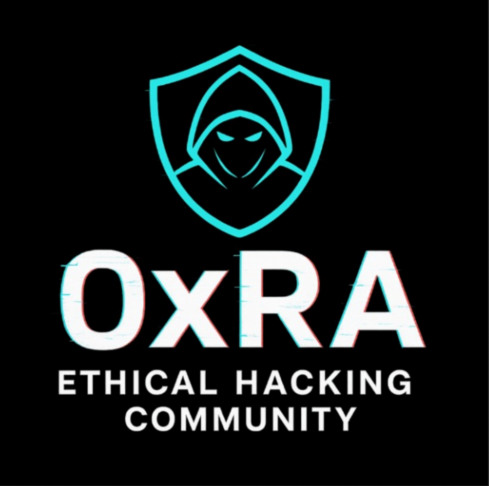

# Hi, I'm Aarav Shah 

### 🧠 A Cybersecurity Enthusiast & Security Researcher

I’m a **Computer Engineering undergraduate** with a deep passion for **Cybersecurity**, **Ethical Hacking**, and **Web Development**.
My mission is to build **secure digital systems** and solve **real-world security challenges** through innovation and ethical hacking.

💬 **Ask me about:** Ethical Hacking, Web App Security, Penetration Testing.
 

  
  &nbsp;&nbsp;
  

  
  &nbsp;&nbsp;&nbsp;&nbsp;&nbsp;
  

---

### 🌐 Connect with Me

  
  
  
  
  

---

### 🧩 Experience

<strong>🔹 Security Researcher @ BugBase</strong> (2024 – Present)
<ul>
  <li>Global Rank <strong>#36</strong> with <strong>100% success rate</strong>.</li>
  <li>Reported impactful vulnerabilities to top-level companies.</li>
</ul>

<strong>🔹 Founder & Community Manager @ 0xRA Ethical Hacker Community</strong> (2025 – Present)
<ul>
  <li>Built and manage a <strong>250+ member</strong> cybersecurity community.</li>
  <li>Mentored juniors in ethical hacking and bug bounty hunting.</li>
</ul>

<strong>🔹 Cybersecurity Lead @ GDG SVIT</strong> (2025 – Present)
<ul>
  <li>Speaker at <strong>Cloud.Secure</strong> on <em>OWASP Top 10 & Live Exploitation</em>.</li>
  <li>Demonstrated <strong>live vulnerability discovery</strong> in the GTU portal.</li>
</ul>

---

### ⚙️ Languages & Tools
<h3 align="center">🔒 Cybersecurity Expertise 🔒</h3>

  
  
  
  
  
  
  
  
  
  
  

<h3 align="center">💻 Programming Languages & Tools 💻</h3>

  

<h3 align="center">🛠️ Tools & Technologies 🛠️</h3>

  

  
  
  
  
  

---

### 🏆 Hall of Fame & Recognitions
- 🏅 **PhonePe** – Hall of Fame | **$250 Bounty** for Responsible Disclosure
- 🚗 **TATA Motors** – Listed in Official Hall of Fame
- 💬 **Airmeet** – Honored for Security Research
- 🎓 **SVIT Cybersecurity Champions** – Recognized for campus security achievements
- 🕵️ **Private Invitations** – Invited by PhonePe, HDFC Bank, VI, ClearTax, Locus, Hike & Flipkart

---

  

